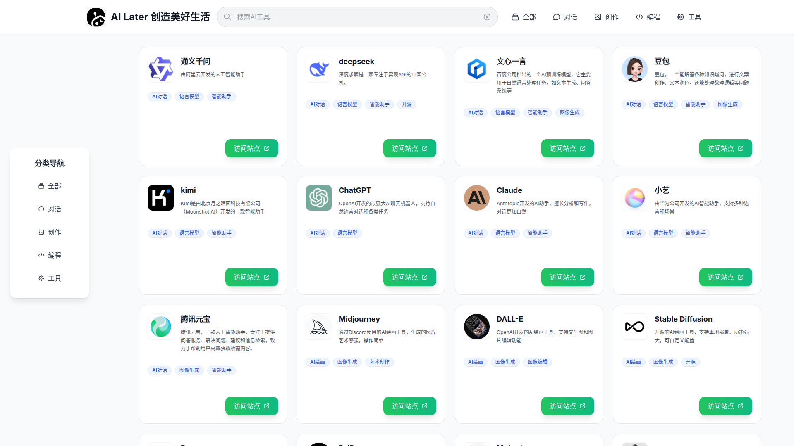

# AI Tools Navigator

<div align="center">


# AI Later 创造美好生活

一个现代化的 AI 工具导航网站，帮助你快速发现和使用最优质的人工智能工具。

[](https://golang.org/)
[](https://gin-gonic.com/)
[](LICENSE)

</div>

## ✨ 功能特点

- 🎨 **精美 UI 设计** - 现代化的界面设计，提供愉悦的浏览体验
- 📱 **响应式布局** - 完美支持桌面端、平板和移动设备
- 🔍 **智能搜索** - 支持按名称和描述快速搜索 AI 工具
- 🏷️ **分类筛选** - 按对话、创作、编程、工具等分类浏览
- ⚡ **数据热重载** - 修改数据文件后自动重新加载，无需重启服务
- 🖼️ **图片容错** - Logo 加载失败时自动生成彩色首字母占位图
- 🚀 **高性能** - 使用 Go + Gin 构建，响应快速

## 🎯 界面预览



## 🛠️ 技术栈

- **后端**: Golang + Gin Framework
- **前端**: HTML5 + Tailwind CSS
- **模板引擎**: Go HTML Templates
- **数据存储**: JSON 文件（支持热重载）

## 📦 本地运行

### 环境要求

- Go 1.24 或更高版本

### 快速开始

```bash
# 1. 克隆项目
git clone https://github.com/crazykun/ai-later.git
cd ai-later

# 2. 复制配置文件
cp config.demo.yaml config.yaml

# 3. 运行项目
go run main.go
```

服务将在 `http://localhost:8080` 启动。

### 构建可执行文件

```bash
go build -o ai-navigator
./ai-navigator
```

## 📁 项目结构

```
.
├── config.demo.yaml    # 配置文件示例
├── config/             # 配置模块
│   └── config.go
├── data/               # 数据文件
│   └── ai.json        # AI 工具数据（支持热重载）
├── global/             # 全局变量
│   └── global.go
├── handlers/           # 处理器
│   └── handlers.go
├── middleware/         # 中间件
│   └── globalmiddleware.go
├── models/             # 数据模型
│   └── site.go
├── static/             # 静态资源
│   ├── css/
│   │   └── style.css
│   ├── img/
│   │   └── logo.png
│   └── js/
│       └── main.js
├── templates/          # HTML 模板
│   ├── layout.html
│   └── index.html
├── utils/              # 工具函数
│   └── color_helper.go
├── main.go             # 程序入口
└── README.md
```

## ⚙️ 配置说明

`config.yaml` 配置文件示例：

```yaml
port: 8080
copyright: "备案信息"
```

## 📊 数据格式

`data/ai.json` 中的站点对象结构：

```json
{
    "name": "站点名称",
    "url": "https://example.com",
    "description": "描述",
    "logo": "/static/img/logo.png",
    "tags": ["标签1", "标签2"],
    "category": "分类",
    "rating": 4.5,
    "featured": true
}
```

修改 `ai.json` 后服务会自动重新加载数据，无需重启。

## 🎨 核心特性说明

### 数据热重载

使用 `fsnotify` 监控 `data/ai.json` 文件变更，文件修改时自动重新加载数据，使用 `sync.RWMutex` 保证并发安全。

### 图片容错处理

当站点 Logo 加载失败时，前端会自动生成彩色首字母占位图，颜色根据站点名称通过哈希算法生成，保持一致性。

### 响应式设计

- 使用 Tailwind CSS 构建响应式布局
- 支持 PC、平板、手机等多种设备
- 移动端优化的导航菜单和搜索体验

## 🚀 部署

### 使用 Docker

```bash
docker build -t ai-navigator .
docker run -p 8080:8080 ai-navigator
```

### 直接部署

```bash
# 构建
go build -o ai-navigator

# 运行
./ai-navigator
```

## 📝 License

MIT License

## 🤝 贡献

欢迎提交 Issue 和 Pull Request！

## 📧 联系方式

如有问题或建议，请提交 Issue。

---

<div align="center">

Made with ❤️ by [crazykun](https://github.com/crazykun)

</div>
